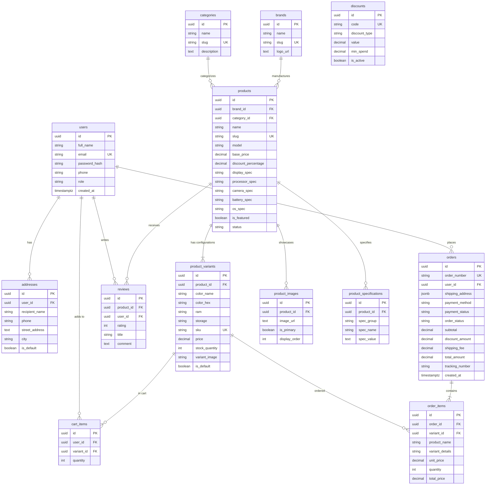

# Mobile Phone Store E-Commerce — Database Design & ERD Specification

## 1. Database Architecture & Design Principles
- **Target RDBMS**: PostgreSQL 16
- **Normalization Level**: 3rd Normal Form (3NF) to eliminate data redundancy while maintaining referential integrity.
- **Primary Keys**: UUIDv4 (`uuid_generate_v4()`) for non-enumerable, globally unique entity identifiers across distributed systems.
- **Financial Precision**: `DECIMAL(12, 2)` for currency calculations to prevent IEEE-754 floating point rounding errors.
- **Audit Trails**: Every key table records `created_at` and `updated_at` timestamps with time zone.
- **ACID Order Processing**: Checkout updates occur inside an explicit transaction block with row-level locks on inventory to prevent race conditions and overselling.

---

## 2. Table Specifications & Data Dictionary

### 2.1 Table: `users`
- **Purpose**: Unified account authentication table for both Customers and Administrators.
- **Columns**:
  - `id` (UUID, PK, Default: `uuid_generate_v4()`): Unique account identifier.
  - `full_name` (VARCHAR(100), NOT NULL): User's legal display name.
  - `email` (VARCHAR(150), UNIQUE, NOT NULL): Login identifier and transactional email receiver.
  - `password_hash` (VARCHAR(255), NOT NULL): Salted bcrypt hash string (never plaintext).
  - `phone` (VARCHAR(20), NULLABLE): Primary telephone contact.
  - `role` (VARCHAR(20), NOT NULL, Default: `'customer'`): System role (`'customer'` or `'admin'`).
  - `avatar_url` (TEXT, NULLABLE): Profile image URL.
  - `created_at` (TIMESTAMPTZ, Default: `CURRENT_TIMESTAMP`): Registration timestamp.
  - `updated_at` (TIMESTAMPTZ, Default: `CURRENT_TIMESTAMP`): Last modification time.
- **Indexes**: `CREATE UNIQUE INDEX idx_users_email ON users(email);`

### 2.2 Table: `addresses`
- **Purpose**: Physical delivery locations linked to customer accounts.
- **Columns**:
  - `id` (UUID, PK, Default: `uuid_generate_v4()`): Address ID.
  - `user_id` (UUID, FK -> `users(id)` ON DELETE CASCADE, NOT NULL): Owner user.
  - `recipient_name` (VARCHAR(100), NOT NULL): Person receiving the package.
  - `phone` (VARCHAR(20), NOT NULL): Contact phone for courier.
  - `street_address` (TEXT, NOT NULL): House number, street, ward.
  - `city` (VARCHAR(100), NOT NULL): City or municipality.
  - `state_province` (VARCHAR(100), NOT NULL): State or province.
  - `postal_code` (VARCHAR(20), NOT NULL): ZIP code.
  - `country` (VARCHAR(100), NOT NULL, Default: `'Vietnam'`): Country.
  - `is_default` (BOOLEAN, Default: `FALSE`): Default shipping selection flag.
  - `created_at` (TIMESTAMPTZ, Default: `CURRENT_TIMESTAMP`).
- **Indexes**: `CREATE INDEX idx_addresses_user ON addresses(user_id);`

### 2.3 Table: `categories`
- **Purpose**: Hierarchical grouping for devices (e.g., Flagship, Mid-Range, Budget, Gaming, Foldable).
- **Columns**:
  - `id` (UUID, PK, Default: `uuid_generate_v4()`).
  - `name` (VARCHAR(100), NOT NULL): Display category name.
  - `slug` (VARCHAR(120), UNIQUE, NOT NULL): URL-safe slug.
  - `description` (TEXT, NULLABLE): Descriptive information.
  - `image_url` (TEXT, NULLABLE): Category banner/thumbnail.
  - `created_at` (TIMESTAMPTZ, Default: `CURRENT_TIMESTAMP`).

### 2.4 Table: `brands`
- **Purpose**: Phone manufacturers (Apple, Samsung, Xiaomi, Google, Sony, OnePlus).
- **Columns**:
  - `id` (UUID, PK, Default: `uuid_generate_v4()`).
  - `name` (VARCHAR(100), NOT NULL): Brand name.
  - `slug` (VARCHAR(120), UNIQUE, NOT NULL): URL-friendly slug.
  - `logo_url` (TEXT, NULLABLE): Brand vector/raster logo.
  - `description` (TEXT, NULLABLE): Brand profile.
  - `created_at` (TIMESTAMPTZ, Default: `CURRENT_TIMESTAMP`).

### 2.5 Table: `products` (Base Phone Models)
- **Purpose**: Canonical mobile device models representing the base product before variant configuration.
- **Columns**:
  - `id` (UUID, PK, Default: `uuid_generate_v4()`).
  - `brand_id` (UUID, FK -> `brands(id)` ON DELETE RESTRICT, NOT NULL).
  - `category_id` (UUID, FK -> `categories(id)` ON DELETE RESTRICT, NOT NULL).
  - `name` (VARCHAR(150), NOT NULL): Model marketing name (e.g., "iPhone 16 Pro Max").
  - `slug` (VARCHAR(180), UNIQUE, NOT NULL): SEO slug.
  - `model` (VARCHAR(100), NOT NULL): Manufacturer internal model code.
  - `description` (TEXT, NULLABLE): Rich marketing and overview description.
  - `base_price` (DECIMAL(12, 2), NOT NULL, CHECK >= 0): Minimum base starting price.
  - `discount_percentage` (DECIMAL(5, 2), Default: `0`, CHECK 0-100): Active promotional discount.
  - `display_spec` (VARCHAR(150), NULLABLE): Quick display summary (e.g., "6.9\" Super Retina XDR OLED 120Hz").
  - `processor_spec` (VARCHAR(150), NULLABLE): SoC summary (e.g., "Apple A18 Pro 3nm").
  - `camera_spec` (VARCHAR(150), NULLABLE): Optical setup (e.g., "48MP Main + 48MP Ultra-Wide + 12MP 5x Telephoto").
  - `battery_spec` (VARCHAR(150), NULLABLE): Battery & charging (e.g., "4,685 mAh, 25W MagSafe").
  - `os_spec` (VARCHAR(100), NULLABLE): Operating system (e.g., "iOS 18").
  - `is_featured` (BOOLEAN, Default: `FALSE`): Homepage showcase flag.
  - `status` (VARCHAR(20), Default: `'active'`, CHECK IN ('active', 'draft', 'archived')).
  - `created_at` (TIMESTAMPTZ, Default: `CURRENT_TIMESTAMP`).
  - `updated_at` (TIMESTAMPTZ, Default: `CURRENT_TIMESTAMP`).
- **Indexes**:
  - `CREATE INDEX idx_products_brand ON products(brand_id);`
  - `CREATE INDEX idx_products_category ON products(category_id);`
  - `CREATE INDEX idx_products_status ON products(status);`

### 2.6 Table: `product_variants` (SKU & Inventory Units)
- **Purpose**: Specific purchasable physical combinations of Color, RAM, and Storage with isolated stock counts.
- **Columns**:
  - `id` (UUID, PK, Default: `uuid_generate_v4()`).
  - `product_id` (UUID, FK -> `products(id)` ON DELETE CASCADE, NOT NULL).
  - `color_name` (VARCHAR(50), NOT NULL): Color name (e.g., "Desert Titanium").
  - `color_hex` (VARCHAR(20), Default: `'#000000'`): Color swatch hex code.
  - `ram` (VARCHAR(20), NOT NULL): RAM capacity (e.g., "8GB", "12GB", "16GB").
  - `storage` (VARCHAR(20), NOT NULL): Internal flash storage (e.g., "256GB", "512GB", "1TB").
  - `sku` (VARCHAR(60), UNIQUE, NOT NULL): Stock Keeping Unit identifier (e.g., "IP16PM-256-DT").
  - `price` (DECIMAL(12, 2), NOT NULL, CHECK >= 0): Specific price for this variant.
  - `stock_quantity` (INT, Default: `0`, CHECK >= 0): Available purchasable inventory.
  - `variant_image` (TEXT, NULLABLE): Specific photograph for this colorway.
  - `is_default` (BOOLEAN, Default: `FALSE`): Default selected variant on detail page.
  - `created_at` (TIMESTAMPTZ, Default: `CURRENT_TIMESTAMP`).
  - `updated_at` (TIMESTAMPTZ, Default: `CURRENT_TIMESTAMP`).
- **Indexes**:
  - `CREATE INDEX idx_variants_product ON product_variants(product_id);`
  - `CREATE INDEX idx_variants_price ON product_variants(price);`

### 2.7 Table: `product_images`
- **Purpose**: High-definition multi-angle gallery images for the product detail viewer.
- **Columns**:
  - `id` (UUID, PK, Default: `uuid_generate_v4()`).
  - `product_id` (UUID, FK -> `products(id)` ON DELETE CASCADE, NOT NULL).
  - `image_url` (TEXT, NOT NULL): Image asset URL.
  - `is_primary` (BOOLEAN, Default: `FALSE`): Primary card thumbnail indicator.
  - `display_order` (INT, Default: `0`): Carousel sorting sequence.

### 2.8 Table: `product_specifications`
- **Purpose**: Exhaustive technical spec sheet for in-depth comparison (Display, SoC, Cameras, Battery, Sensors, Network).
- **Columns**:
  - `id` (UUID, PK, Default: `uuid_generate_v4()`).
  - `product_id` (UUID, FK -> `products(id)` ON DELETE CASCADE, NOT NULL).
  - `spec_group` (VARCHAR(60), NOT NULL): E.g., "Display", "Hardware", "Camera", "Battery".
  - `spec_name` (VARCHAR(100), NOT NULL): E.g., "Resolution", "Peak Brightness", "Chipset".
  - `spec_value` (TEXT, NOT NULL): E.g., "2868 x 1320 pixels at 460 ppi", "2000 nits".
  - `display_order` (INT, Default: `0`).

### 2.9 Table: `cart_items`
- **Purpose**: Persistent shopping cart storage for logged-in customers.
- **Columns**:
  - `id` (UUID, PK, Default: `uuid_generate_v4()`).
  - `user_id` (UUID, FK -> `users(id)` ON DELETE CASCADE, NOT NULL).
  - `variant_id` (UUID, FK -> `product_variants(id)` ON DELETE CASCADE, NOT NULL).
  - `quantity` (INT, Default: `1`, CHECK > 0).
  - `created_at` (TIMESTAMPTZ, Default: `CURRENT_TIMESTAMP`).
  - `updated_at` (TIMESTAMPTZ, Default: `CURRENT_TIMESTAMP`).
  - **Constraint**: `UNIQUE (user_id, variant_id)` to prevent duplicate item rows.

### 2.10 Table: `orders`
- **Purpose**: Immutable record of confirmed customer purchases.
- **Columns**:
  - `id` (UUID, PK, Default: `uuid_generate_v4()`).
  - `order_number` (VARCHAR(30), UNIQUE, NOT NULL): Human-readable tracking ID (e.g., "ORD-1726243890-781").
  - `user_id` (UUID, FK -> `users(id)` ON DELETE RESTRICT, NOT NULL).
  - `shipping_address` (JSONB, NOT NULL): Complete frozen snapshot of recipient address at checkout time.
  - `payment_method` (VARCHAR(50), NOT NULL, CHECK IN ('COD', 'Bank Transfer', 'Credit Card', 'E-Wallet')).
  - `payment_status` (VARCHAR(30), Default: `'pending'`, CHECK IN ('pending', 'paid', 'failed', 'refunded')).
  - `order_status` (VARCHAR(30), Default: `'pending'`, CHECK IN ('pending', 'processing', 'shipped', 'delivered', 'cancelled')).
  - `subtotal` (DECIMAL(12, 2), NOT NULL).
  - `discount_amount` (DECIMAL(12, 2), Default: `0`).
  - `shipping_fee` (DECIMAL(12, 2), Default: `0`).
  - `total_amount` (DECIMAL(12, 2), NOT NULL).
  - `tracking_number` (VARCHAR(100), NULLABLE): Courier tracking ID (e.g., "VNPOST-99281").
  - `notes` (TEXT, NULLABLE): Customer checkout delivery notes.
  - `created_at` (TIMESTAMPTZ, Default: `CURRENT_TIMESTAMP`).
  - `updated_at` (TIMESTAMPTZ, Default: `CURRENT_TIMESTAMP`).

### 2.11 Table: `order_items`
- **Purpose**: Individual line items inside an order with frozen prices and variant details.
- **Columns**:
  - `id` (UUID, PK, Default: `uuid_generate_v4()`).
  - `order_id` (UUID, FK -> `orders(id)` ON DELETE CASCADE, NOT NULL).
  - `variant_id` (UUID, FK -> `product_variants(id)` ON DELETE RESTRICT, NOT NULL).
  - `product_name` (VARCHAR(150), NOT NULL): Frozen product model name at order time.
  - `variant_details` (VARCHAR(200), NOT NULL): Frozen specs (e.g., "Desert Titanium | 8GB / 256GB").
  - `unit_price` (DECIMAL(12, 2), NOT NULL): Frozen price per unit at order time.
  - `quantity` (INT, NOT NULL, CHECK > 0).
  - `total_price` (DECIMAL(12, 2), NOT NULL): `unit_price * quantity`.

### 2.12 Table: `reviews`
- **Purpose**: Customer ratings and verified feedback for products.
- **Columns**:
  - `id` (UUID, PK, Default: `uuid_generate_v4()`).
  - `product_id` (UUID, FK -> `products(id)` ON DELETE CASCADE, NOT NULL).
  - `user_id` (UUID, FK -> `users(id)` ON DELETE CASCADE, NOT NULL).
  - `rating` (INT, NOT NULL, CHECK >= 1 AND <= 5): 1 to 5 star rating.
  - `title` (VARCHAR(150), NULLABLE).
  - `comment` (TEXT, NULLABLE).
  - `created_at` (TIMESTAMPTZ, Default: `CURRENT_TIMESTAMP`).
  - **Constraint**: `UNIQUE (product_id, user_id)` (one verified review per user per device).

### 2.13 Table: `discounts` (Coupons)
- **Purpose**: Promotional discount codes applicable during checkout.
- **Columns**:
  - `id` (UUID, PK, Default: `uuid_generate_v4()`).
  - `code` (VARCHAR(50), UNIQUE, NOT NULL): Uppercase voucher code (e.g., "NEWPHONE50").
  - `description` (TEXT, NULLABLE).
  - `discount_type` (VARCHAR(20), NOT NULL, CHECK IN ('percentage', 'fixed')).
  - `value` (DECIMAL(10, 2), NOT NULL, CHECK > 0): Percentage (e.g., 10%) or fixed dollar amount.
  - `min_spend` (DECIMAL(12, 2), Default: `0`).
  - `valid_from` (TIMESTAMPTZ, Default: `CURRENT_TIMESTAMP`).
  - `valid_to` (TIMESTAMPTZ, NULLABLE).
  - `is_active` (BOOLEAN, Default: `TRUE`).
  - `created_at` (TIMESTAMPTZ, Default: `CURRENT_TIMESTAMP`).

---

## 3. Entity-Relationship Diagram (ERD)



---

## 4. How Checkout is Stored (Transactional Walkthrough)

When a customer checks out, the backend executes the following atomic ACID steps:

```sql
BEGIN TRANSACTION;

-- Step 1: Lock and verify stock for all cart items
SELECT id, stock_quantity, price FROM product_variants
WHERE id IN ('c1000000-0000-0000-0000-000000000001')
FOR UPDATE;

-- Step 2: Validate that stock_quantity >= requested_quantity (e.g., 1)
-- If insufficient, throw error and ROLLBACK.

-- Step 3: Decrement stock quantity
UPDATE product_variants
SET stock_quantity = stock_quantity - 1,
    updated_at = CURRENT_TIMESTAMP
WHERE id = 'c1000000-0000-0000-0000-000000000001';

-- Step 4: Insert the immutable Order record
-- Address is snapshot as JSONB so future customer edits do not distort historical orders.
INSERT INTO orders (
    id, order_number, user_id, shipping_address, payment_method,
    payment_status, order_status, subtotal, discount_amount, shipping_fee, total_amount, notes
) VALUES (
    'e1000000-0000-0000-0000-000000000001',
    'ORD-20260913-9841',
    '11111111-1111-1111-1111-111111111111',
    '{"recipient_name": "Nguyen Van A", "phone": "0901234567", "street_address": "123 Le Loi Street", "city": "Ho Chi Minh City", "country": "Vietnam"}'::jsonb,
    'COD',
    'pending',
    'pending',
    1199.00,
    0.00,
    0.00,
    1199.00,
    'Please call 15 minutes before delivery'
);

-- Step 5: Insert Order Items with frozen price and spec snapshot
INSERT INTO order_items (
    id, order_id, variant_id, product_name, variant_details, unit_price, quantity, total_price
) VALUES (
    'f1000000-0000-0000-0000-000000000001',
    'e1000000-0000-0000-0000-000000000001',
    'c1000000-0000-0000-0000-000000000001',
    'iPhone 16 Pro Max',
    'Color: Desert Titanium, RAM: 8GB, Storage: 256GB',
    1199.00,
    1,
    1199.00
);

-- Step 6: Clear the customer's cart
DELETE FROM cart_items WHERE user_id = '11111111-1111-1111-1111-111111111111';

COMMIT;
```

**Key Architectural Safeguards**:
1. **Historical Immutability**: If the administrator later edits the iPhone 16 Pro Max price from $1199 to $1299, the customer's order still retains `unit_price: 1199.00` in `order_items`.
2. **Address Decoupling**: If the user updates their saved address in their profile next month, the past order's `shipping_address` JSONB remains untouched.
3. **No Race Conditions**: `FOR UPDATE` prevents two concurrent buyers from purchasing the last available unit simultaneously.
