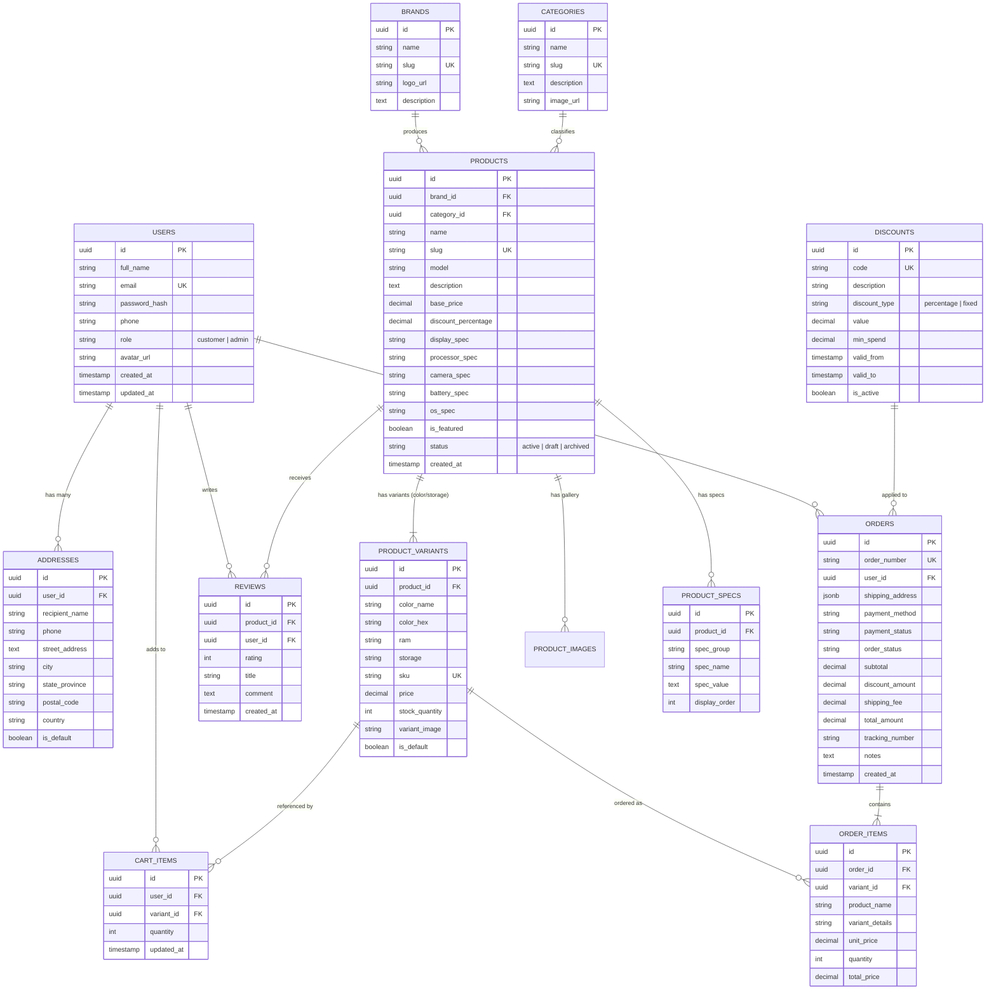

# Mobile Phone Store — Entity Relationship (ER) Diagram

This document presents the complete relational database architecture for the Mobile Phone Store E-Commerce system.

## 1. Visual ER Diagram (Mermaid)

## 2. Table Summary & Normalization Rationale

- **3rd Normal Form (3NF)**: Transitive dependencies removed. Brand and category attributes are separated into dedicated lookup entities.
- **Variant Independence**: Physical phone stock, color choices, RAM, and storage tiers are separated into `product_variants`. This prevents duplicate product records and enables accurate inventory accounting per SKU.
- **Relational Integrity**: Foreign key constraints with `ON DELETE CASCADE` on dependent children (e.g., variants, images, specs) and `ON DELETE RESTRICT` on historical purchase records (orders) to prevent accidental data loss.
- **Auditability**: Order addresses and item snapshots (`product_name`, `variant_details`, `unit_price`) are frozen at time of purchase so historical receipts remain accurate even if phone catalog prices change in the future.
