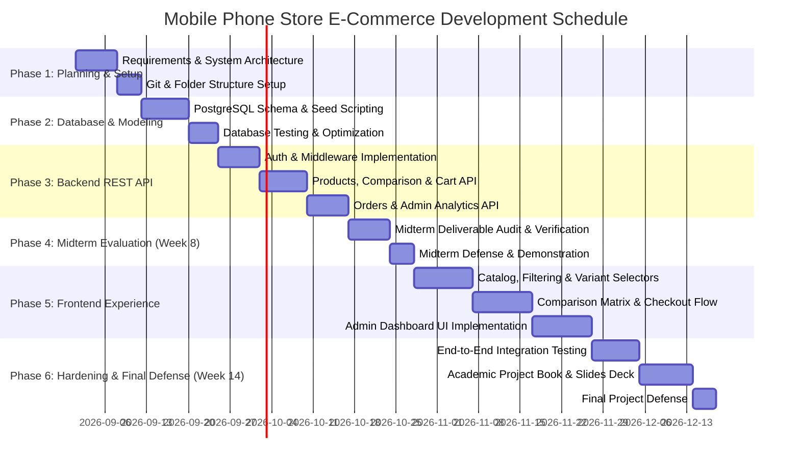

# Mobile Phone Store E-Commerce — Project Plan & System Requirements

**Course / Degree**: B.Sc. Computer Science / Software Engineering  
**Project Title**: Mobile Phone Store Online Business E-Commerce System  
**Stack**: React (Frontend) • Node.js / Express (Backend) • PostgreSQL (Database)  
**Academic Target**: Week 8 Midterm & Week 14 Final Evaluation  

---

## 1. Project Background
The rapid evolution of consumer mobile technology has made smartphones complex technical investments. Consumers rarely purchase based solely on price; they evaluate hardware parameters such as processor architectures (nanometer node, core clusters), optical camera arrays (sensor sizes, focal lengths, aperture, optical stabilization), display technology (refresh rate, peak nits, panel type), and thermal/battery endurance. 

Most generic e-commerce templates treat electronics like apparel, forcing separate listings for each color and storage variant, displaying unstructured text descriptions, and failing to provide structured hardware comparisons. This project develops **NEXUS PHONES**, a specialized, full-stack e-commerce system engineered specifically for mobile device retailing.

---

## 2. Problem Statement
Existing conventional online electronic storefronts suffer from four critical deficiencies:
1. **Disjointed Product Modeling**: Color and storage options are frequently created as standalone products rather than unified variants, cluttering search results and confusing buyers.
2. **Lack of Side-by-Side Technical Comparison**: Customers must open multiple browser tabs to compare screen resolution, chipsets, and battery specs because platforms lack a normalized comparison engine.
3. **Inventory Race Conditions**: Inadequate transaction management during checkout leads to overselling items with limited stock.
4. **Administrative Opacity**: Store administrators lack an integrated control hub to manage multi-tiered SKU inventory, process orders through a structured state machine, and track fulfillment metrics.

---

## 3. Proposed Solution
A purpose-built, responsive Web application featuring:
- A **Customer Storefront** built with React, featuring dynamic variant selection (live price and stock reflection), multi-criteria spec filtering, interactive side-by-side comparison (2–4 devices), shopping cart drawer, wishlist, and transactional checkout.
- An **Admin Management Portal** for managing products, variants, technical specification sheets, order statuses, and customer accounts.
- A **RESTful Node.js (Express) API** enforcing role-based access control, input validation, and business logic.
- A **Normalized PostgreSQL Database** (3NF) ensuring transactional integrity (`ACID`), relational integrity with foreign keys, and auditability of order snapshots.

---

## 4. Project Goal
To design, implement, and deploy an academic-grade, responsive, and secure full-stack Mobile Phone Store E-Commerce web application that provides a seamless shopping experience for consumers and an efficient management dashboard for store administrators.

---

## 5. Project Objectives (SMART)
- **Objective 1 (Architecture)**: Implement a decoupled 3-tier architecture (React SPA $\to$ Express REST API $\to$ PostgreSQL) with clean separation of concerns.
- **Objective 2 (Data Modeling)**: Construct a normalized PostgreSQL schema supporting base phones, dynamic variants (RAM/Storage/Color/SKU), structured hardware specs, and historical order snapshots.
- **Objective 3 (Comparison Engine)**: Build a hardware comparison module capable of dynamically aligning 2 to 4 phone models across standardized metric rows.
- **Objective 4 (Transactional Reliability)**: Enforce PostgreSQL transactions (`BEGIN ... COMMIT / ROLLBACK`) during checkout to guarantee atomic inventory decrement.
- **Objective 5 (Security & RBAC)**: Implement stateless JWT authentication, password hashing with bcrypt, role-based authorization (`customer` vs `admin`), and parameterized queries to prevent SQL injection.
- **Objective 6 (Academic Deliverables)**: Complete all deliverables required for Week 8 Midterm (Project plan, UI, API tests, ER diagram, Git repo) and Week 14 Final (System defense, Project Report/Book, slides).

---

## 6. Target Users

| User Persona | Role | Primary Goals & Characteristics |
| :--- | :--- | :--- |
| **Smartphone Shopper** | Guest / Customer | Browses catalog, compares technical specs between phones, configures desired color & storage, places orders, tracks shipment status. |
| **Store Administrator** | Admin | Manages phone catalog, adds new phone models with technical specs, monitors inventory levels, fulfills and updates customer orders. |
| **Academic Evaluator** | Professor / Assessor | Inspects architecture cleanliness, database normalization, security practices, and code quality. |

---

## 7. System Scope

### In-Scope (Core System)
- Customer account registration, login, profile management, and JWT session handling.
- Mobile phone catalog browsing, full-text search, brand filtering, category filtering, RAM/storage filtering, and price sorting.
- Dynamic variant switching (color swatches, storage tiers) with instant price and stock recalculation.
- Side-by-side phone comparison matrix (2 to 4 phones).
- Shopping cart with real-time stock validation and quantity adjustments.
- Transactional multi-step checkout supporting Cash on Delivery (COD) and mock digital payments.
- Order history with itemized invoice breakdown and fulfillment state machine.
- Admin dashboard displaying revenue metrics, order totals, and low-stock alerts.
- Admin management for products, variants, specifications, orders, and customer accounts.

### Out-of-Scope (Future Enhancements)
- Real credit card processing via live Stripe/PayPal payment gateways (mock gateway utilized for academic defense).
- Real SMS gateway integration (in-app notifications and email summaries used instead).
- Multi-warehouse logistics routing.

---

## 8. Customer Requirements
- **CR-01**: The customer must be able to create an account with email validation and secure password creation.
- **CR-02**: The customer must be able to search for phones by model, brand, or chipset keyword.
- **CR-03**: The customer must be able to filter phones by brand, category, RAM, storage, and price range.
- **CR-04**: The customer must be able to view high-resolution image galleries and full technical specification sheets.
- **CR-05**: The customer must be able to select color and storage variants on the product detail page and observe real-time price and stock updates.
- **CR-06**: The customer must be able to select 2 to 4 phones and view an aligned side-by-side comparison matrix.
- **CR-07**: The customer must be able to manage a shopping cart (add variant, increment/decrement quantity, delete item, view subtotal).
- **CR-08**: The customer must be able to input a shipping address, select a payment method, apply a coupon code, and place an order.
- **CR-09**: The customer must be able to view their order history, order items, and live delivery status.

---

## 9. Admin Requirements
- **AR-01**: The administrator must be able to log in securely using privileged credentials.
- **AR-02**: The administrator must be able to view store analytics: gross revenue, total orders, active catalog models, and low inventory warnings.
- **AR-03**: The administrator must be able to create new phone listings with brand, category, base price, discount %, and hardware specs.
- **AR-04**: The administrator must be able to create and manage variant SKUs (color, RAM, storage, price, stock).
- **AR-05**: The administrator must be able to delete phone listings from the active catalog.
- **AR-06**: The administrator must be able to view all orders and transition fulfillment status (`Pending` $\to$ `Processing` $\to$ `Shipped` $\to$ `Delivered` $\to$ `Cancelled`).
- **AR-07**: The administrator must be able to assign courier tracking numbers to dispatched orders.
- **AR-08**: The administrator must be able to view the customer roster with order count and lifetime spend.

---

## 10. Functional Requirements (FR)

### Module 1: Authentication & Authorization
- **FR-AUTH-01**: The system shall register users with name, unique email, password, and phone number.
- **FR-AUTH-02**: The system shall hash user passwords using `bcrypt` (minimum 10 salt rounds) before database storage.
- **FR-AUTH-03**: The system shall authenticate credentials and return a signed JSON Web Token (JWT) valid for 7 days.
- **FR-AUTH-04**: The system shall restrict `/api/admin/*` routes strictly to users with role = `admin`.

### Module 2: Catalog & Search
- **FR-CAT-01**: The system shall list products with pagination (default: 12 items per page).
- **FR-CAT-02**: The system shall filter catalog results via SQL query parameters: `brand`, `category`, `minPrice`, `maxPrice`, `ram`, `storage`.
- **FR-CAT-03**: The system shall perform case-insensitive keyword searches across product name, model, and brand.
- **FR-CAT-04**: The system shall sort products by `newest`, `price_asc`, `price_desc`, and `rating`.

### Module 3: Phone Specifications & Comparison
- **FR-SPEC-01**: The system shall return base phone details, all active variants, image galleries, and grouped specifications for a given phone slug.
- **FR-SPEC-02**: The system shall accept 2 to 4 product UUIDs at `/api/products/compare` and return normalized hardware matrices.

### Module 4: Cart & Transactional Checkout
- **FR-CART-01**: The system shall associate shopping cart items with authenticated user accounts and target variant IDs.
- **FR-CART-02**: The system shall prevent adding quantities that exceed the variant's current `stock_quantity`.
- **FR-CART-03**: The system shall execute checkout within a database transaction:
  1. Lock target variants (`FOR UPDATE`).
  2. Verify stock sufficiency.
  3. Deduct inventory (`stock_quantity = stock_quantity - order_qty`).
  4. Create `orders` record with order number and shipping JSON snapshot.
  5. Create itemized `order_items` records with historical unit prices.
  6. Empty the user's shopping cart.

### Module 5: Admin Management
- **FR-ADM-01**: The system shall aggregate total sales, total orders, active products, and low stock count ($\le 10$ units).
- **FR-ADM-02**: The system shall allow administrators to insert products with variants in a single transactional operation.
- **FR-ADM-03**: The system shall update order states and attach tracking strings.

---

## 11. Non-Functional Requirements (NFR)
- **NFR-SEC-01 (Security)**: All passwords must be hashed using bcrypt. Sensitive credentials must never be committed to Git or exposed in API responses.
- **NFR-SEC-02 (SQL Injection Prevention)**: All database interactions must use parameterized queries (`$1, $2, ...`). Direct string interpolation in SQL is strictly forbidden.
- **NFR-PERF-01 (Performance)**: API catalog endpoints must respond within $< 300\text{ ms}$ under standard loads through database indexing on foreign keys and slugs.
- **NFR-RESP-01 (Responsiveness)**: The user interface must adapt fluidly across viewport widths from $360\text{ px}$ (mobile) to $1920\text{ px}$ (desktop).
- **NFR-REL-01 (Reliability & Atomicity)**: Checkout operations must be strictly atomic (`ACID`). If any item in a checkout fails stock validation, all changes must roll back without partial data mutations.
- **NFR-MAINT-01 (Maintainability)**: Codebase must maintain strict decoupling between presentation components, state controllers, and data access layers.

---

## 12. User Roles

```
        +-------------------------------------------------------+
        |                      GUEST USER                       |
        |  - Browse catalog, search, compare phones, view specs |
        +---------------------------+---------------------------+
                                    | Registers / Logs in
                                    v
        +-------------------------------------------------------+
        |                    CUSTOMER USER                      |
        |  - All Guest features                                 |
        |  - Manage Cart & Wishlist                             |
        |  - Place Orders & Apply Coupons                       |
        |  - View Invoices & Track Shipments                    |
        |  - Manage Profile & Addresses                         |
        +-------------------------------------------------------+
                                    | Promoted / Assigned
                                    v
        +-------------------------------------------------------+
        |                 ADMINISTRATOR USER                    |
        |  - All Customer features                              |
        |  - Access Executive Dashboard & Financial Metrics     |
        |  - Create, Edit, Delete Phone Models & Variants       |
        |  - Fulfill Orders & Update Dispatch Status            |
        |  - Manage Customer Accounts & Inventory Audits        |
        +-------------------------------------------------------+
```

---

## 13. Permissions Matrix

| Resource / Action | Guest | Customer | Administrator |
| :--- | :---: | :---: | :---: |
| Browse Catalog & Search | ✅ | ✅ | ✅ |
| View Product Details & Specs | ✅ | ✅ | ✅ |
| Compare 2–4 Phones | ✅ | ✅ | ✅ |
| Add / Modify Shopping Cart | ❌ | ✅ | ✅ |
| Manage Wishlist | ❌ | ✅ | ✅ |
| Place Order & Checkout | ❌ | ✅ | ✅ |
| View Own Order History | ❌ | ✅ | ✅ |
| Access Admin Dashboard | ❌ | ❌ | ✅ |
| Add / Delete Products | ❌ | ❌ | ✅ |
| Update Order Fulfillment Status | ❌ | ❌ | ✅ |
| View All Customer Accounts | ❌ | ❌ | ✅ |

---

## 14. Main System Modules
1. **Authentication & User Module**: Registration, login, profile editing, JWT issuance, and role enforcement middleware.
2. **Product Catalog Module**: Base phone retrieval, brand and category taxonomies, multi-criteria filtering, full-text search, and sorting algorithms.
3. **Phone Comparison Engine**: Matrix alignment comparing display, chipset, camera, battery, and dimensions across 2 to 4 phone IDs.
4. **Cart & Wishlist Module**: User-bound cart persistence, quantity controls, and stock limit constraints.
5. **Checkout & Order Module**: Multi-payment method handler, coupon calculation, transactional inventory deduction, order invoice generator.
6. **Admin Dashboard Module**: Business intelligence counters, inventory thresholds, product CRUD, and order fulfillment state machine.

---

## 15. Business Rules (BR)
- **BR-01 (Stock Guarantee)**: A customer cannot add more units of a variant to their cart than are currently available in `product_variants.stock_quantity`.
- **BR-02 (Price Freezing)**: When an order is placed, unit price and variant details must be captured as immutable snapshots in `order_items` so subsequent product price changes do not alter historical records.
- **BR-03 (Order Cancellation)**: Customers can cancel an order only while its status is `pending`. Once an order moves to `processing`, `shipped`, or `delivered`, only an Administrator can cancel it.
- **BR-04 (Coupon Qualification)**: A coupon discount can only be applied if the cart subtotal meets or exceeds the coupon's `min_spend` threshold.
- **BR-05 (Comparison Limit)**: A user can compare a minimum of 2 and a maximum of 4 smartphones at any one time to maintain readability and UI balance.
- **BR-06 (Shipping Calculation)**: Orders with a subtotal $\ge \$500$ receive free express delivery; otherwise, a flat fee of $\$25$ is applied.

---

## 16. System Workflows

### A. Customer Purchase Workflow
```
[Customer browses Catalog]
           │
           ▼
[Selects Phone -> Chooses Color & Storage Variant]
           │
           ▼
[Adds to Shopping Cart (Stock Verified)]
           │
           ▼
[Navigates to Checkout]
           │
           ▼
[Enters Shipping Address & Chooses Payment Method (COD / Bank Transfer)]
           │
           ▼
[Places Order -> PostgreSQL Transaction Begins]
           ├─► Locks Target Variant Rows
           ├─► Re-verifies Stock Availability
           ├─► Deducts Stock Quantity
           ├─► Inserts Order & Order Items Snapshot
           ├─► Clears Customer Shopping Cart
           └─► Commits Transaction (Returns Order #)
           │
           ▼
[Order Confirmation Screen -> Customer Tracks Status in "My Orders"]
```

### B. Admin Order Fulfillment Workflow
```
[Order Placed by Customer: Status = "pending"]
           │
           ▼
[Admin reviews order in Admin Dashboard]
           │
           ▼
[Admin verifies stock & moves status to "processing"]
           │
           ▼
[Device packaged -> Dispatched with Courier]
           │
           ▼
[Admin inputs Courier Tracking Number & advances status to "shipped"]
           │
           ▼
[Courier completes delivery -> Admin marks status as "delivered"]
```

---

## 17. Feature Classification

### A. Essential Features (Required for University Capstone)
1. User registration & secure login with JWT.
2. Normalized phone catalog (Brands, Categories, Base Phones, Variants).
3. Live variant selector (Color swatches, RAM/Storage tiers with dynamic price & stock).
4. Multi-criteria search and filter (Brand, Category, RAM, Storage, Price, Sort).
5. Interactive side-by-side phone comparison matrix (2 to 4 phones).
6. Shopping cart with quantity modification and stock constraint checks.
7. Multi-step checkout with coupon support and order placement.
8. Order history with itemized invoice receipt and live status tracking.
9. Admin dashboard with revenue analytics, inventory management, and order fulfillment.
10. Relational PostgreSQL database with constraints and foreign keys.

### B. Optional Future Features (Post-Academic Roadmap)
1. Live Stripe / PayPal credit card processing with webhooks.
2. Automated SMS shipping updates via Twilio.
3. Customer trade-in valuation calculator for old phones.
4. Product review image attachment uploads.
5. Multi-language localization (i18n).

---

## 18. Development Timeline (Week 1 – Week 14)



---

## 19. Week 8 Midterm Requirements Checklist

- [x] **1. Project Plan**: Completed comprehensive project background, problem statement, objectives, functional requirements, and milestone timeline ([docs/project_requirements_and_plan.md](file:///d:/Project_Y4/E-Commerce/docs/project_requirements_and_plan.md)).
- [x] **2. Frontend UI**: Responsive React application with modern dark titanium theme, glassmorphic header, product catalog with dynamic filter pills, interactive variant selector, side-by-side comparison engine, and shopping cart.
- [x] **3. Backend UI / Code Test**: Layered Express REST API with 12 automated integration tests verifying authentication, catalog retrieval, variant resolution, comparison, cart, and transactional checkout (`npm test`).
- [x] **4. Database Diagram**: 3NF normalized PostgreSQL ER diagram with explicit foreign keys, UUID primary keys, and field dictionaries ([docs/database_diagram.md](file:///d:/Project_Y4/E-Commerce/docs/database_diagram.md)).
- [x] **5. Git/GitHub Deployment**: Clean Git commit history with `.gitignore` excluding secrets and dependencies, ready for remote repository push.
